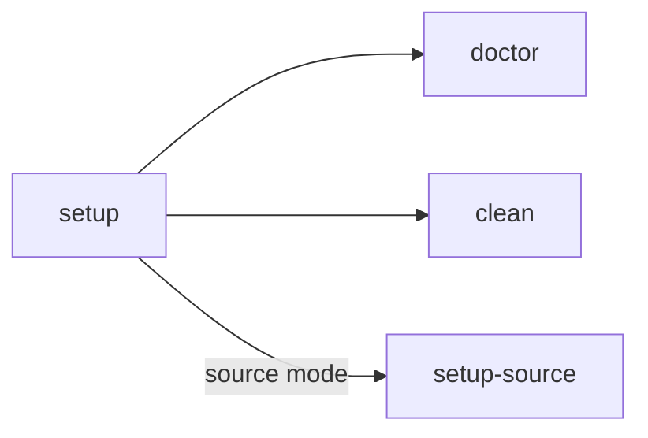

<p align="center">
  
  
</p>

<h1 align="center">Liferay Workspace Claude Plugin</h1>

<p align="center">
  <strong>Set up, manage, and develop in Liferay DXP workspaces with AI-powered slash commands.</strong>
</p>

---

Slash commands for Liferay DXP workspaces: Docker/source setup, hotfixes, licenses, portal source search, and PR review.

---

## Install

```bash
# Dev / local install — point Claude Code at the plugin directory
claude --plugin-dir /path/to/liferay-workspace-claude-plugin
```

For a persistent install via marketplace:

```bash
/plugin marketplace add liferay/liferay-workspace-claude-plugin
/plugin install liferay-workspace@liferay-workspace-plugins
```

## Quick Start

From your Liferay Workspace root:

```
/liferay-workspace:setup
```

The wizard walks you through Docker- or source-mode setup, generates `.liferay-workspace.json`, and brings the stack up. Run `/liferay-workspace:doctor` afterwards to verify health.

---

## Skills

| Category | Skill | Description |
|---|---|---|
| Workspace | `/liferay-workspace:setup [source]` | Interactive workspace configuration wizard — Docker or source mode |
| Workspace | `/liferay-workspace:setup-source` | Write source-mode config files (`docker-compose.source.yml`, portal env props) |
| Workspace | `/liferay-workspace:doctor` | Prerequisite checks and running-service health dashboard |
| Workspace | `/liferay-workspace:clean` | Remove containers, build artifacts, and bundle data |
| Workspace | `/liferay-workspace:core <mode> <query>` | Portal source analysis — `root-cause` or `guide` modes |
| Dev | `/liferay-workspace:pr-review [PR URL\|number\|diff]` | Review a pull request against Liferay best practices — rebase state, ticketed commits, Jira link, commit-message quality |

---

## Workflow

The natural setup chain:

```
setup → doctor
```

`core` is invoked on demand for portal-source analysis, and `pr-review` reviews a pull request independent of the chain.

<details>
<summary><strong>Cross-skill call graph</strong></summary>



</details>

---

## Prerequisites

| Requirement | Version | Notes |
|---|---|---|
| **JDK** | 17 – 23 | Required for all modes |
| **Docker** | Any recent | Required for containerized services |
| **jq** | Any | Required for hotfix metadata parsing |
| **Apache Ant** | Any | Source mode only (used by `ant setup-profile-dxp && ant all`) |
| **ripgrep (`rg`)** | Any | Recommended for `core` skill — falls back to `grep` if missing |

Run `/liferay-workspace:doctor` to verify your environment.

---

## Configuration

The plugin generates a `.liferay-workspace.json` file in your workspace root during setup:

```json
{
  "version": "2026.q1.2",
  "hotfix": "liferay-dxp-2026.q1.2-hotfix-1.zip",
  "hotfixCommit": "abc123def",
  "mode": "docker",
  "paths": {
    "source": "/path/to/liferay-portal-ee",
    "bundleCache": "~/.liferay/liferay-binaries-cache-2020",
    "bundles": "/path/to/bundles",
    "license": "~/.liferay/activation/activation-key.xml"
  },
  "elements": ["liferay", "db", "search", "mail"]
}
```

| Field | Description |
|-------|-------------|
| `version` | DXP version extracted from `gradle.properties` or hotfix |
| `hotfix` | Selected hotfix filename (if any) |
| `hotfixCommit` | Git commit SHA from hotfix metadata |
| `mode` | `docker` or `source` |
| `paths.source` | Path to `liferay-portal-ee` clone |
| `paths.bundleCache` | Path to binary cache for offline builds |
| `paths.bundles` | Output directory for compiled bundles |
| `paths.license` | Path to DXP activation key |
| `elements` | Services included in docker-compose |

---

## Scripts

The skills shell out to two user-facing scripts in `scripts/`. Files prefixed with `_` (`_helpers.sh`, `_logging.sh`, `_prereqs.sh`, `_steps.sh`) are sourced helpers, not entry points.

| Script | Usage | Description |
|--------|-------|-------------|
| `local_setup.sh` | `bash scripts/local_setup.sh [all\|up\|prereqs\|clean\|build\|start\|stop\|license] [--source]` | Main lifecycle script — `all` runs prereqs → setup_env → clean → build → start → license; `up` skips clean. `--source` switches to source mode (reads `paths.source`/`paths.bundles` from `.liferay-workspace.json`). |
| `rg-liferay.sh` | `bash scripts/rg-liferay.sh -t java -m journal "updateStatus"` | Fast portal source search. Pattern is the last argument. |

<details>
<summary><strong>rg-liferay.sh options</strong></summary>

| Flag | Description |
|------|-------------|
| `-d <dir>` | Search root (default: current directory) |
| `-t <type>` | File type filter: `java`, `xml`, `jsp`, `js`, `properties`, `gradle`, `bnd`, `ftl`, `css`, `yaml` |
| `-m <module>` | Restrict to a specific module path (e.g. `portal-kernel`, `modules/apps/journal`) |
| `-l` | List matching files only (no content) |
| `-n <limit>` | Max results (default: 40) |
| `-i` | Case-insensitive search |
| `-w` | Whole-word matching |
| `-C <lines>` | Context lines around each match (default: 2) |

</details>

---

## Docker vs Source Mode

| | Docker Mode | Source Mode |
|---|---|---|
| **How it runs** | Liferay in a DXP container image | Liferay built and run from source |
| **Setup time** | ~5 minutes | 30–60+ minutes (first build) |
| **Best for** | Client extensions, theme dev, testing | Core debugging, portal patches, deep investigation |
| **Services** | All in Docker (Liferay + DB + Search + ...) | Only supporting services in Docker; Liferay runs locally |
| **Config files** | `docker-compose.yml`, `configs/docker/` | `docker-compose.source.yml`, `configs/source/` |

---

## Examples

<details>
<summary><strong>Setting up a Docker workspace</strong></summary>

```
> /liferay-workspace:setup

┌─────────────────────────────────────────────────┐
│ Liferay Workspace Setup                         │
├──────────────┬──────────────────────────────────┤
│ Mode         │ Docker                           │
│ Bundle cache │ ~/.liferay/liferay-binaries-...  │
│ Hotfix       │ liferay-dxp-2026.q1.2-hf-1.zip  │
│ DXP License  │ activation-key-enterprise.xml    │
└──────────────┴──────────────────────────────────┘

Type a setting name to change it, or "ok" to continue.

> ok

Select services:
  [x] 1. Liferay      — DXP container (required)
  [x] 2. DB           — PostgreSQL 16
  [x] 3. Search       — Elasticsearch
  [x] 4. Mail         — Mailpit
  [ ] 5. ServiceNow   — Mock server

✓ docker-compose.yml generated
✓ .liferay-workspace.json written
✓ Modules deployed
✓ Services started
✓ DXP license applied

Liferay DXP 2026.q1.2 is running at http://localhost:8080
```

</details>

<details>
<summary><strong>Setting up from source</strong></summary>

```
> /liferay-workspace:setup source

# Same interactive setup, plus:
✓ liferay-portal-ee cloned at abc123d
✓ Portal built (took 42 minutes)
✓ Source configs written
✓ Supporting services started (DB, Search, Mail)

Liferay DXP (source) running at http://localhost:8080
```

</details>

<details>
<summary><strong>Checking workspace health</strong></summary>

```
> /liferay-workspace:doctor

Prerequisites
  ✓ JDK 21.0.2
  ✓ Docker 27.5.1

Workspace
  Mode: Docker | Version: 2026.q1.2 | Hotfix: hf-1

Services
  ✓ lr       — Up (healthy) → http://localhost:8080
  ✓ db       — Up (healthy) → localhost:5432
  ✓ search   — Up (healthy) → http://localhost:9200
  ✓ mail     — Up (healthy) → http://localhost:8025
```

</details>

<details>
<summary><strong>Investigating a bug in portal source</strong></summary>

```
> /liferay-workspace:core root-cause NPE in JournalArticleLocalServiceImpl when approving articles with null display date

Searching portal source...
  → Found JournalArticleLocalServiceImpl in modules/apps/journal/journal-service
  → Located updateStatus() method at line 4521
  → displayDate accessed without null check after workflow transition

Root Cause: When an article is approved via workflow, updateStatus()
reads displayDate from the article's current version. If the article
was created via Headless API without a displayDate, the field is null,
and the subsequent Calendar conversion at line 4538 throws NPE.

Module: journal-service
File: JournalArticleLocalServiceImpl.java:4538
Fix: Add null guard before Calendar.getInstance() conversion.
```

</details>

<details>
<summary><strong>Learning how to use a feature</strong></summary>

```
> /liferay-workspace:core guide batch engine client extensions for importing object definitions

Searching portal source...
  → Found batch-engine modules in modules/apps/batch-engine
  → Reading BatchEngineImportTaskResource API
  → Found sample client extensions in workspaces/

Usage Guide:
  1. Create a batch client extension with client-extension.yaml
  2. Define your object schema in batch/*.json files
  3. Configure import strategy in batch-engine-data.json
  ...
  [complete guide with code snippets derived from source]
```

</details>

<details>
<summary><strong>Reviewing a pull request</strong></summary>

```
> /liferay-workspace:pr-review https://github.com/org/repo/pull/42

PR Review — LPD-12345 Add custom field validation for object definitions
========================================================================
  ✓ Branch rebased on target (no merge commits)
  ✓ Every commit references the ticket (LPD-12345)
  ✓ Description links the Jira story
  ✗ Source Formatter commit is not the last commit
  ⚠ Service Builder output mixed into a custom-logic commit

Findings:
  - Move the `LPD-12345 SF` commit to the end of the branch
  - Split Service Builder output into its own `LPD-12345 Build Service` commit
```

</details>

<details>
<summary><strong>Cleaning the workspace</strong></summary>

```
> /liferay-workspace:clean

Select items to clean:
  [x] 1. Docker      — stop containers, remove orphans
  [x] 2. Bundles     — remove data, deploy, logs, osgi, esdata
  [x] 3. Build       — remove node_modules, dist, build dirs
  [ ] 4. Portal home — kill processes, delete bundles (source mode)

  ✓ Docker containers stopped
  ✓ Bundle data removed
  ✓ Build artifacts cleaned
```

</details>

---

## Contributing

Skills live under `skills/<name>/SKILL.md` (Claude Code skill format); shared lifecycle logic is in `scripts/`. To add a skill, create the directory, write `SKILL.md`, and shell out to scripts as needed. See [`claude-docs/extend-claude-with-skills.md`](claude-docs/extend-claude-with-skills.md) for the authoring guide.

## License

MIT
